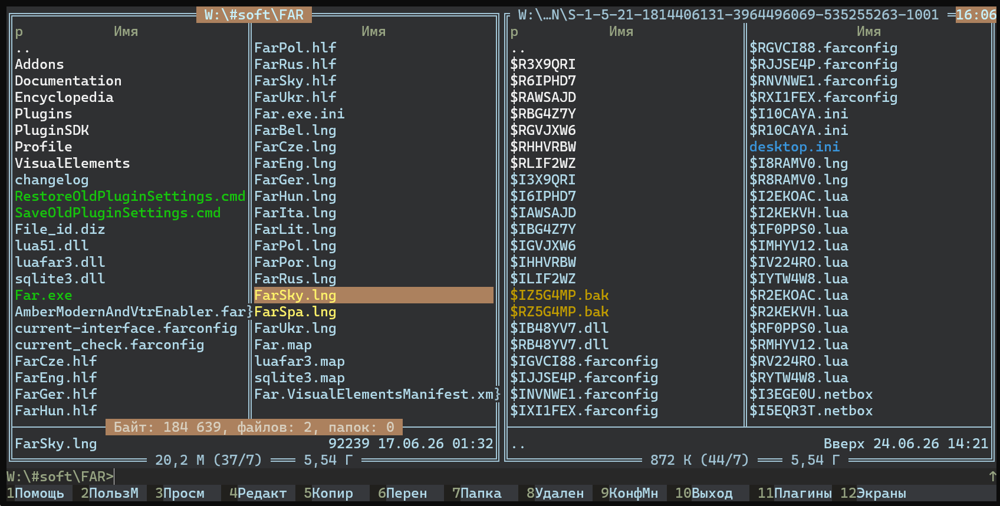

🇺🇸 [English](../README.md) | 🇺🇦 [Українська](README-uk.md) | 🇧🇾 [Беларуская](README-be.md) | <sub>ru</sub> [Русский](README-ru.md) | 🇵🇱 [Polski](README-pl.md) | 🇨🇿 [Čeština](README-cs.md) | 🇸🇰 [Slovenčina](README-sk.md) | 🇩🇪 [Deutsch](README-de.md) | 🇮🇹 [Italiano](README-it.md) | 🇪🇸 [Español](README-es.md)

[](https://www.farmanager.com/) [](https://github.com/LanKing/far-tools/releases/download/amber-modern-latest/AmberModernAndVtrEnabler.farconfig) [](https://github.com/LanKing/far-tools/releases) [](../LICENSE) 

# 🎨 Amber Modern színtéma

> Azoknak, akik megunták a Far Manager klasszikus kék megjelenését, és modern, nyugodt, szemkímélő színsémát szeretnének.



## 📓 Megjegyzések

1. A téma nem módosítja a fájlok színezési szabályait — a Far Managerben már beállított szabályokat használja.
2. A téma beállítja a szerkesztő és a megjelenítő alapszíneit, de nem tartalmaz saját szintaxiskiemelést. A szerkesztőhöz a [Monokai](https://github.com/joric/monokai) témát használom, és ajánlom kipróbálásra.

## 📦 Telepítés

Az Amber Modern kibővített színpalettát használ, ezért be kell kapcsolni a **Virtual Terminal Rendering** funkciót. A szükséges beállítás már engedélyezve van a témafájlban.

1. [Töltse le a témát](https://github.com/LanKing/far-tools/releases/download/amber-modern-latest/AmberModernAndVtrEnabler.farconfig), és helyezze a fájlt a Far Manager könyvtárába.
2. Zárja be teljesen a Far Manager összes futó példányát.
3. Futtassa a következő parancsot:

   ```bat
   far.exe /import AmberModernAndVtrEnabler.farconfig
   ```

4. Indítsa újra a Far Managert.

## 📄 Licenc

Az Amber Modern az [MIT licenc](../LICENSE) feltételei szerint terjeszthető. A fejlesztéseket és javaslatokat örömmel fogadjuk 😊
